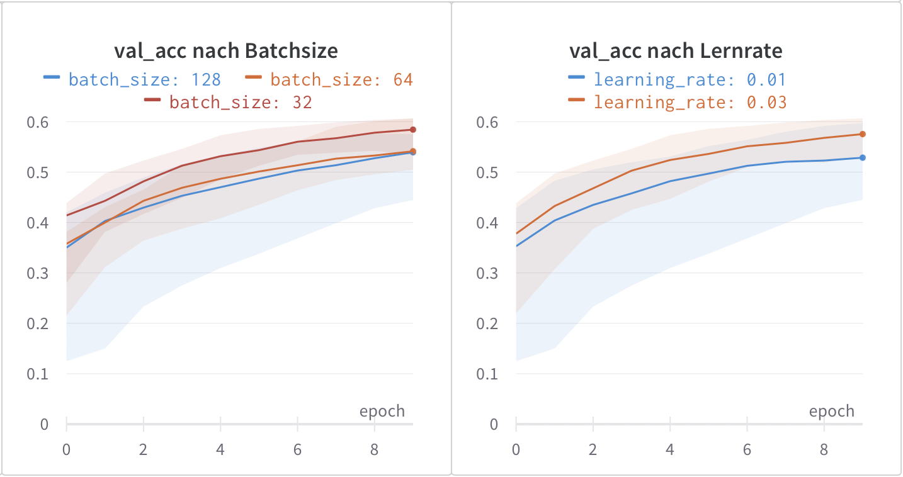

---

# Activate Marp
marp: true

# Metadata
title: DEL MC1 Präsentation
description: Erste Deep Learning Präsentation
author: Gabriel Torres Gamez
date: 2023-04-15

# Theme settings
theme: chef-gabo
class: invert
header: 'DEL MC1 Präsentation'
footer: 'Gabriel Torres Gamez'
color: #ffffff

# Slide settings
paginate: true
math: true

---

# Hyperparameter und Model Tuning
Erste Mini Challenge des Moduls Deep Learning an der FHNW

---

# Datensatz und Ziel
- CIFAR-10
- 10 Klassen
- 32x32 Pixel, 3 Farbkanäle
- 60000 Bilder (50000 Trainingsbilder, 10000 Validierungsbilder)
- Ziel: Korrekte Klassifizierung der Bilder

---

# Hauptframeworks
- PyTorch 2
- PyTorch Lightning 2
- Weights & Biases 0.14

---

# Verwendete Metriken (Train & Validation)
## Accuracy Score
- Verhältnis korrekt klassifizierter Bilder
## F1 Macro Score
- Mittelwert der F1 Scores aller Klassen
- Bestimmt durch Precision und Recall
- Gut geeignet um bevorzugungsfreie Modelle zu finden

---

# Preprocessing
- Umwandlung der Bilder -> Tensor
- Normalisierung der Pixelwerte auf alle Farbkanäle
$\hat{x} = 0.5$, $\sigma = 0.5$

---

# Architekturvergleich
## MLP
- Besteht nur aus Fully Connected Layers
- Für Vektoren geeignet
- Bilder können zu Vektoren umgewandelt werden (flatten)
## CNN
- Besteht aus Convolutional Layers und Fully Connected Layers
- Für Bilder geeignet

---

# Learning Rate und Batchsize
- Batchsizes: 
    - 32 Bilder
    - 64 Bilder
    - 128 Bilder
- Learning Rates: 
    - 0.01
    - 0.03

---

# Gewichtsinizialisierung
- Xavier (normal/uniform)
- Kaiming (normal/uniform)
- default

---

# Conv2D Layer
TODO: Bild einfügen
- Kernelsize: 5
- Padding: (Kernelsize - 1) / 2
- Sparsam Max Pooling

---

# Fazit zur Modellkomplexität
TODO: Bild einfügen
- Komplexere Modelle für Bilder
- Bilddimensionen beibehalten
- Gewichtsinitialisierung wichtig
- Grid Search benötigt

---

# Ridge Regularisierung und Dropout
- Ridge: Bestraft große Gewichte
- Dropout: Zufälliges Ausschalten von Neuronen
## Ziel
- Overfitting verhindern
- Kann besser generalisieren

---

## Ergebnisse
- 5% Accuracy Score Unterschied

---

# Batch Normalization
TODO: Bild hinzufügen
- Normalisiert Daten pro Layer
## Ziel
- Beschleunigt das Training
## Ergebnisse
- Schnellerer Start
- Stagniert schneller
- Schlechterer Accuracy Score

---

# Optimierung mit Adam
- Schnellerer Start
- Stagniert wie SGD
- Kein grosser Unterschied

---

# Bestes CNN Modell (val_acc: 0.75)

- Conv2D Layer 128 Filter
- Conv2D Layer 64 Filter
- Conv2D Layer 32 Filter
- Max Pooling (2,2)
- Linear Layer 512
- Linear Layer 256
- Linear Layer 128
- Linear Layer 64
- Linear Layer 10

---

# Extra: ResNeXt-50
- Batchsize: 128
- Epochs: 100
- SGD: 
    - LR=0.01
    - Momentum=0.9
    - Weight Decay=0.0005
- val_acc: 0.7 😥

---

## Extra: Von ChatGPT vorgeschlagene Architektur
- Batchsize: 128
- Epochs: 100
- SGD: 
    - LR=0.01
    - Momentum=0.9
    - Weight Decay=0.0005
- val_acc: 0.88 🤯🤯🤯

---

# Lessons Learned
- PyTorch + Lightning + Weights & Biases
- Image Classification w/ CNNs
- Kleine Batchsize -> bessere Generalisierung
- Gewichtsinitialisierung beachten
- Für LR, Dropout, L2 ect. keine Faustregeln
- MaxPooling je nach vorhandenen Ressourcen
- Padding helps!