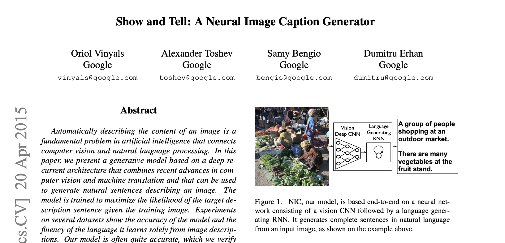
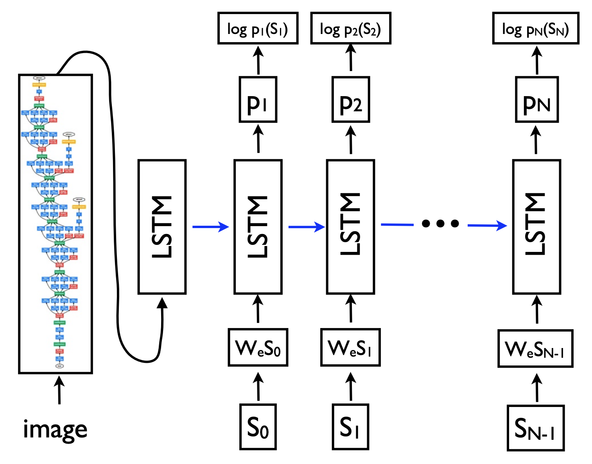
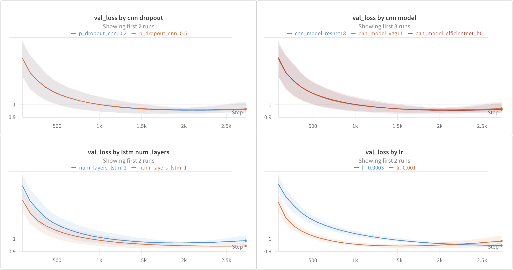
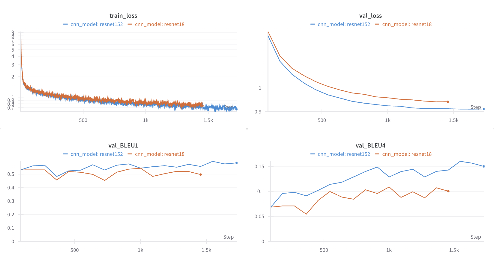
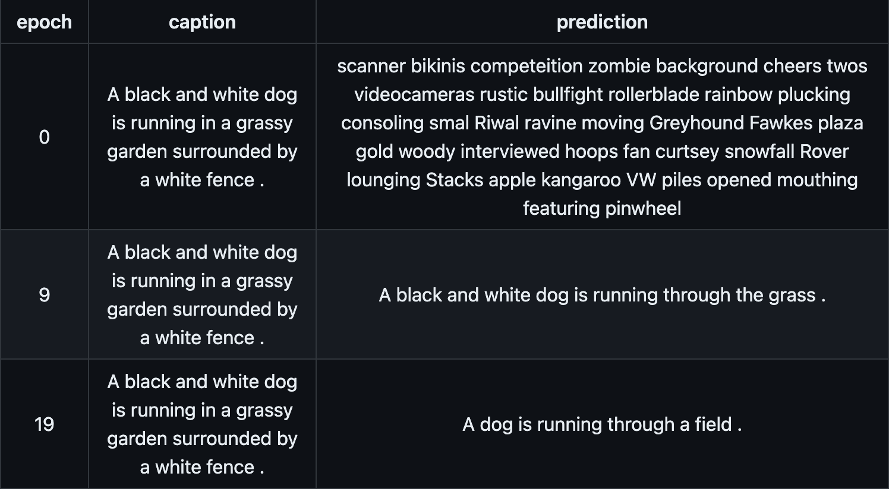
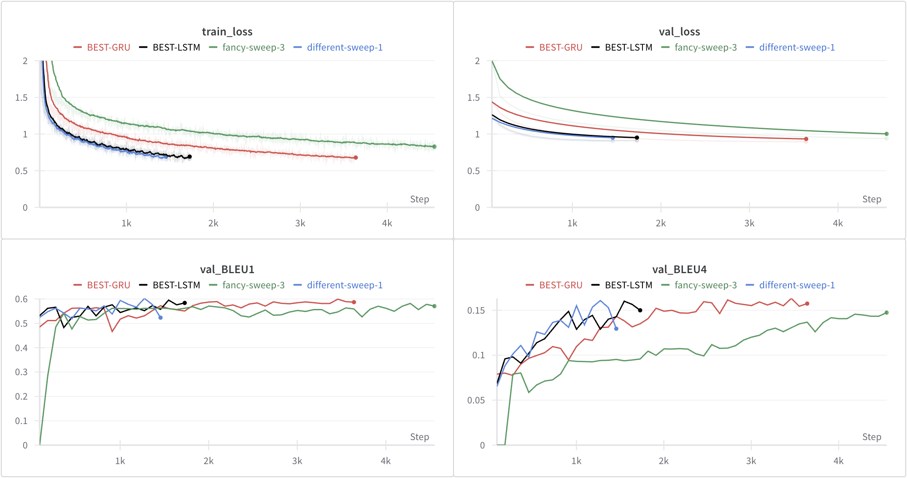
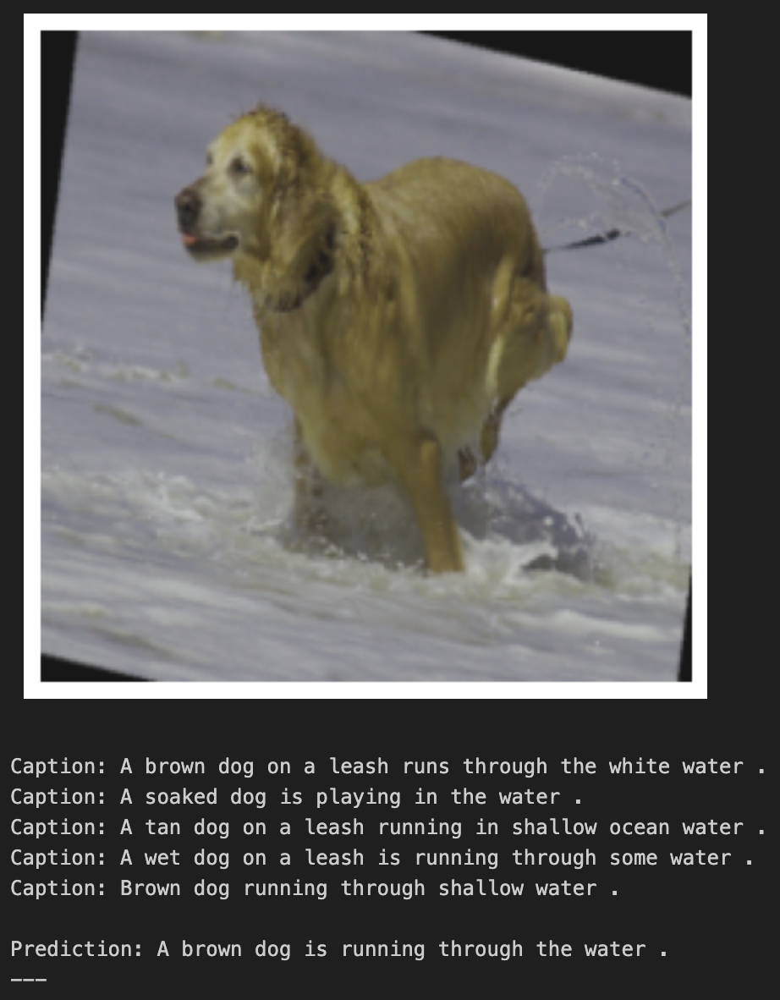
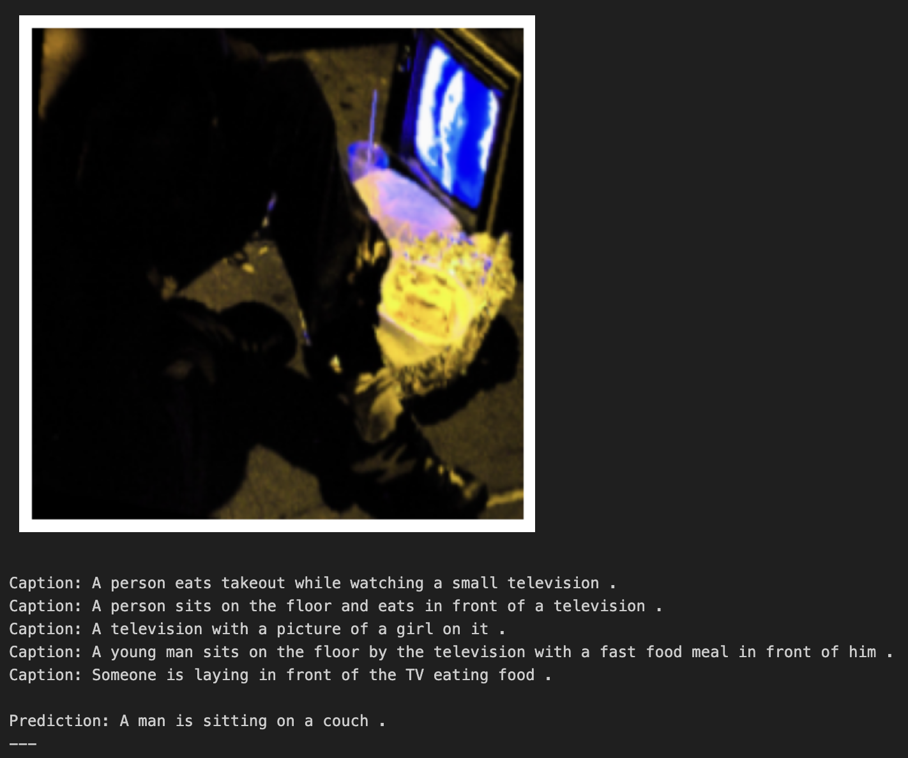

---

# Activate Marp
marp: true

# Metadata
title: DEL MC2 Präsentation
description: Zweite Deep Learning Präsentation
author: Gabriel Torres Gamez
date: 2024-01-07

# Theme settings
theme: chef-gabo
class: invert
header: 'DEL MC2 Präsentation'
footer: 'Gabriel Torres Gamez'
color: #ffffff

# Slide settings
paginate: true
math: true

---

# Paper-Studium und Umsetzung
Zweite Mini Challenge des Moduls Deep Learning an der FHNW

---

## Datensatz und Ziel
🎯 Erstellung von Captions für Bilder<br>
💽 Flickr8k
↔ Unterschiedliche Bilddimensionen, 3 Farbkanäle
🌄 8091 Bilder (70% Train, 15% Val, 15% Test)
💬 5 Captions/Bild

---

## Hauptframeworks
🔦 PyTorch
⚡️ PyTorch Lightning
📒 Weights & Biases

---

## Referenzpaper


---

## Architektur
- Image Encoder (CNN)
- Caption Encoder (nn.Embedding)
- Captioning Decoder (LSTM)


---

## Verwendete Metriken: BLEU
### BLEU-1
- Überprüft Unigramme
- Korrekte Wörter vorhanden?

### BLEU-2,3 und 4
- Überprüft Bigramme, Trigramme, Quadrigramme
- Korrekte Wortreihenfolge?

---

## Image Preprocessing
```python
transform = transforms.Compose(
    [
        transforms.ToPILImage(),
        transforms.RandomHorizontalFlip(),
        transforms.RandomRotation(10),
        transforms.ColorJitter(brightness=0.2, contrast=0.2, 
                               saturation=0.2, hue=0.1),
        transforms.Resize((224, 224)),
        transforms.RandomResizedCrop(224, scale=(0.8, 1.0)),
        transforms.ToTensor(),
    ]
)
```

---

## Text Preprocessing
Example Caption:
```
A child in a pink dress is climbing up a set of stairs in an entry way .
```

Tokenized caption (with nltk word tokenizer):
```
['<start>', 'A', 'child', 'in', 'a', 'pink', 'dress', 'is', 'climbing', 
'up', 'a', 'set', 'of', 'stairs', 'in', 'an', 'entry', 'way', '.', '<end>', 
'<pad>', '<pad>', ...]
```

Tokenized caption (index in dictionary):
```
[9630, 68, 2580, 4910, 1240, 6514, 3457, 4995, 2675, 9105, 1240,
7526, 6030, 8185, 4910, 1411, 3665, 9334, 13, 9631, 9632, 9632, ...]
```

---

## Sweep 1 (Verhalten der Hyperparameter)
```python
sweep_config = {
    "method": "grid",
    "name": "ShowAndTell",
    "parameters": {
        "optimizer": {"values": ["Adam"]},
        "lr": {"values": [0.001, 0.0003]},
        "weight_decay": {"values": [0.00001]},
        "cnn_model": {"values": ["efficientnet_b0", "vgg11", "resnet18"]},
        "embed_size": {"values": [512]},
        "p_dropout_cnn": {"values": [0.5, 0.2]},
        "hidden_size_lstm": {"values": [512]},
        "num_layers_lstm": {"values": [1, 2]},
        "n_epochs": {"values": [30]},
    },
}
```

---



---

## Sweep 2 (Vergleich der Modellgrösse)
```python
sweep_config = {
    "method": "grid",
    "name": "ShowAndTell2", # changed
    "parameters": {
        "optimizer": {"values": ["Adam"]},
        "lr": {"values": [0.001]}, # changed
        "weight_decay": {"values": [0.00001]},
        "cnn_model": {"values": ["resnet18", "resnet152"]}, # changed
        "embed_size": {"values": [512]},
        "p_dropout_cnn": {"values": [0.5]}, # changed
        "hidden_size_lstm": {"values": [512]},
        "num_layers_lstm": {"values": [1]}, # changed
        "n_epochs": {"values": [30]},
    },
}
```

---



---



---

## Sweep 3 (GRU anstatt LSTM)
```python
sweep_config = {
    "method": "grid",
    "name": "ShowAndTellGRU", # changed
    "parameters": {
        "optimizer": {"values": ["Adam"]},
        "lr": {"values": [0.001, 0.0003, 0.0001]}, # changed
        "weight_decay": {"values": [0.00001]},
        "cnn_model": {"values": ["resnet152"]},
        "embed_size": {"values": [512]},
        "p_dropout_cnn": {"values": [0.5]},
        "hidden_size_gru": {"values": [512]},
        "num_layers_gru": {"values": [1]},
        "n_epochs": {"values": [50]},
    },
}
```

---



---

## Metriken (Bestes LSTM)
|            |          Datensatz          | Unser Modell | Referenzmodell |
| :--------: | :-------------------------: | :----------: | :------------: |
| ㅤBLEU-1ㅤ |          Flickr8k           |    0.5923    |      0.63      |
| ㅤBLEU-2ㅤ |          Flickr8k           |    0.3716    |       :(       |
| ㅤBLEU-3ㅤ |          Flickr8k           |    0.2390    |       :(       |
| ㅤBLEU-4ㅤ |          Flickr8k           |    0.1555    |       :(       |
| ㅤBLEU-4ㅤ | ㅤMSCOCO (123'287 images)ㅤ |      -       |     0.277      |

---

## Gelungenes Beispiel


---

## Ungelungenes Beispiel


---

## Mögliche Verbesserungen
- Tiefere Lernrate, dafür mehr Epochen
- Mehr Daten
- Stärkere Image Encoder (Panoptische Segmentierung?)
- Beam Search
---

## Lessons Learned
❗️ Image Encoder wichtig!
🚫 Captioning Decoder eher unwichtig..<br>
👍🏼 Teacher Forcing für Textgeneration
❗️ BLEU-1 Metrik ergänzen!