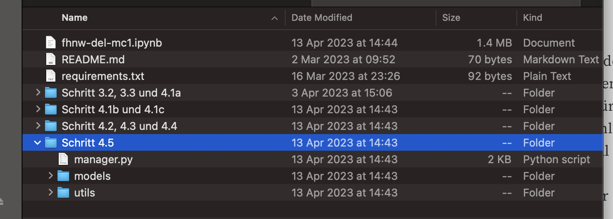
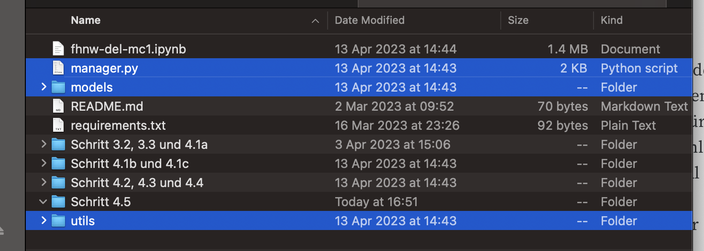

# Benutzung
Um die Modelle zu testen muss der Ordner mit dem dazugehörigen Schritt in den Hauptordner kopiert werden. 
Die Ordnerstruktur sollte beibehalten werden:

Vor dem Entpacken:

Nach dem Entpacken:

# Link zum Bericht
Die Erkenntnisse und die Ergebnisse zu Aufgabe 4 sind im Bericht zusammengefasst.